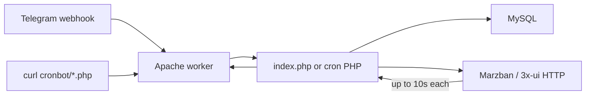

# Query and cron load — inventory (no code changes yet)

Apache wedging ~10 minutes after the crontab change is **not** explained by MySQL being OOM-killed again. Workers sit in PHP until they finish. Most of that time is **VPN panel HTTP**, then **unindexed / RAND() SQL**, then **extra round-trips in `update()`**.

Confirm on the VPS first: `crontab -u www-data -l`. If lines still contain `curl https://…/cronbot/`, the schedule change in `function.php` never landed on the server. Opening `/panel` only rewrites crontab after the new `function.php` is uploaded. CLI + `flock` crons do **not** occupy Apache; `curl` crons do.

---

## Why Apache fills (15 `MaxRequestWorkers`)



- Webhook `max_connections=5` can hold 5 workers.
- Remaining `curl` crons (if still HTTP) hold more.
- Each `DataUser()` / `getusers()` call uses `$request_exec_timeout = null` → **10s** curl in [`request.php`](request.php).
- `NoticationsService` does that **up to 30 times per run**. One job can pin a process for minutes.

SQL refactors below reduce MySQL time. They will **not** stop Apache hangs if panel HTTP stays slow and crons still go through `curl`.

---

## 1. `invoice` cron scan — [`cronbot/NoticationsService.php`](cronbot/NoticationsService.php)

**Query**

```sql
SELECT * FROM invoice
WHERE (Status IN ('active','end_of_time','end_of_volume','sendedwarn','send_on_hold'))
  AND name_product != 'سرویس تست'
  AND (time_cron <= :hour_ago OR time_cron IS NULL)
ORDER BY time_cron
LIMIT 30;
```

**Problem**

- [`table.php`](table.php) creates `invoice` with **only** `PRIMARY KEY (id_invoice)`. No index on `Status`, `time_cron`, `name_product`, `id_user`, `username`.
- `SELECT *` pulls `user_info` / `uuid` TEXT on every row.
- Per row: `select(marzban_panel)`, `select(user)`, `DataUser()` (HTTP), then `update(invoice, time_cron)` which does **SELECT … FOR UPDATE** + **UPDATE**.

**Solution**

1. Index (run once on the server):

```sql
ALTER TABLE invoice
  ADD INDEX idx_invoice_cron (Status, time_cron),
  ADD INDEX idx_invoice_user (id_user, Status),
  ADD INDEX idx_invoice_username (username);
```

2. Select only columns the cron needs (`id_invoice`, `id_user`, `username`, `Service_location`, `Status`, `time_cron`, `notifctions`, `bottype`).
3. Batch-load panels and users (`WHERE name_panel IN (...)` / `WHERE id IN (...)`) instead of `select()` per invoice.
4. Skip `DataUser()` when `time_cron` is still inside the 1600s guard (today the HTTP call can still happen after a useless `update` of `time_cron`).
5. Lower `LIMIT 30` to `10` on this 1 GB box, or process sequentially with a hard time budget (e.g. stop after 8s).

---

## 2. `ORDER BY RAND()` — disable / active / test / on_hold

| File | Query |
|---|---|
| [`cronbot/disableconfig.php`](cronbot/disableconfig.php) | `SELECT id FROM user WHERE checkstatus = '2' ORDER BY RAND() LIMIT 10` then `SELECT * FROM invoice WHERE id_user = ? AND Status IN (…) ORDER BY RAND() LIMIT 10` |
| [`cronbot/activeconfig.php`](cronbot/activeconfig.php) | Same with `checkstatus = '1'` and `Status = 'disablebyadmin'` |
| [`cronbot/configtest.php`](cronbot/configtest.php) | `SELECT * FROM invoice WHERE status != 'disabled' AND name_product = 'سرویس تست' ORDER BY RAND() LIMIT 15` |
| [`cronbot/on_hold.php`](cronbot/on_hold.php) | `SELECT * FROM marzban_panel WHERE type = 'marzban' ORDER BY RAND() LIMIT 25` |

**Problem**

`ORDER BY RAND()` full-scans and sorts the whole table every minute (or every 2/15 min). Nested RAND on invoices multiplies that. `on_hold` then calls `getusers($panel, "on_hold")` for up to **25 panels**.

**Solution**

- Index: `user(checkstatus)`, `invoice(id_user, Status)`, `invoice(name_product, Status)`, `marzban_panel(type)`.
- Replace RAND with `ORDER BY id` / `time_cron` / `id_invoice` and `LIMIT n`, or `WHERE id > :cursor` keyset pagination.
- `on_hold.php`: one panel per run, not 25. That cron already warned on `['users']` being null when the panel API failed.

---

## 3. `update()` always locks — [`function.php`](function.php) `update()`

**Query pattern**

```sql
SELECT $field FROM $table WHERE $whereField = ? FOR UPDATE;
UPDATE $table SET $field = ? WHERE $whereField = ?;
```

**Problem**

Every single-field update is two statements. `FOR UPDATE` without an open transaction commits immediately, so it does **not** give a real atomic section; it still extra-locks the row. Cron paths call this for `time_cron`, `notifctions`, `Status` on each invoice.

**Solution**

- Fast path: one `UPDATE … SET col = ? WHERE pk = ?` (no `SELECT FOR UPDATE`) unless the caller started a transaction.
- Batch: `UPDATE invoice SET time_cron = ? WHERE id_invoice IN (…)`.
- Do not log every update to [`logs/update.log`](logs/update.log) on hot columns (`time_cron`); that file already grows quickly.

---

## 4. Unbounded `user` scan — [`cronbot/expireagent.php`](cronbot/expireagent.php)

**Query**

```sql
SELECT * FROM user WHERE expire IS NOT NULL;
```

**Problem**

Loads every agent-expire row, no `LIMIT`, no `expire < UNIX_TIMESTAMP()`. Full table every 30 minutes, then Telegram for each expired user.

**Solution**

```sql
SELECT id, username, expire FROM user
WHERE expire IS NOT NULL AND expire < UNIX_TIMESTAMP()
LIMIT 50;
```

Index: `user(expire)`.

---

## 5. Payment waiting lists — [`cronbot/croncard.php`](cronbot/croncard.php)

**Query**

```sql
SELECT * FROM Payment_report
WHERE payment_Status = 'waiting'
  AND Payment_Method IN ('cart to cart', 'arze digital offline')
  AND bottype IS NULL;
```

**Problem**

No `LIMIT`. `SELECT *`. No index on `(payment_Status, Payment_Method)`. Each matching row can run `DirectPayment()`.

**Solution**

Index `Payment_report(payment_Status, Payment_Method)`. Add `LIMIT 20` and `ORDER BY id`. Select needed columns only.

(`plisio.php` / `iranpay1.php` have the same pattern; they are removed from crontab. Leave the files, or they will hurt again if re-added via `curl`.)

---

## 6. Per-request `select()` N+1 — webhook [`index.php`](index.php)

**Problem**

Every Telegram update: `select("setting","*")`, `select("user",…)`, topic IDs, etc. `select()` caches **in-process only** (one Apache request). Next webhook repeats the same SQL. `setting` is one row read thousands of times per hour.

**Solution**

- APCu / file cache for `setting`, `textbot`, `PaySetting` (TTL 5–15s). Invalidation already exists (`clearSelectCache` on `update()`).
- Do not `SELECT *` from `user` when only `step` / `Balance` / `User_Status` are needed.

This helps webhook latency; it is secondary to panel HTTP.

---

## 7. Panel HTTP is the real worker-holder — [`panels.php`](panels.php) `DataUser()`, [`Marzban.php`](Marzban.php) `getusers()`

Not SQL, but this is what matches “Apache dead after 10 minutes” better than any `SELECT`.

**Solution**

- Keep crons on **PHP CLI + flock** (never `curl` through Apache).
- Set `$request_exec_timeout` in `config.php` to **3000–4000** (ms) on this VPS, not `null` (10s).
- Cache panel user JSON ~60s keyed by `panel + username` (file or APCu). Cron and webhook share it.
- Cap concurrent panel calls (already have flock per cron; do not run Notications + disable + configtest + on_hold in the same minute).

---

## Suggested order (when implementing)

1. Confirm live crontab is CLI, not `curl`. If it is still `curl`, Apache will wedge regardless of indexes.
2. Add the `invoice` / `user` / `Payment_report` indexes (low risk, high win for #1–5).
3. Kill `ORDER BY RAND()` in the four crons.
4. Slim `update()` (drop extra `FOR UPDATE` when not in a transaction).
5. Bound `expireagent` and `croncard` with `LIMIT` + `WHERE expire < now`.
6. Panel timeout + short cache for `DataUser`.

Do not raise Apache `MaxRequestWorkers` or Telegram `max_connections` until 1–3 are done; more workers on hung panel calls only brings back OOM.
